# User usage

## Using Psi

### Register to the transport

Login to your XMPP account normally, like you would do if the transport
did not exist at all.

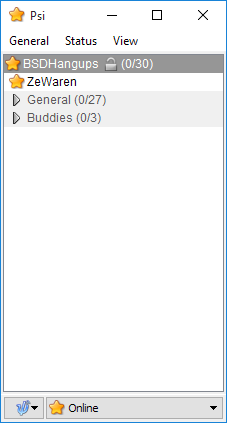

Open the service discovery tool:

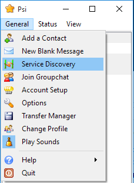

Find the transport and start the registration procedure on it:

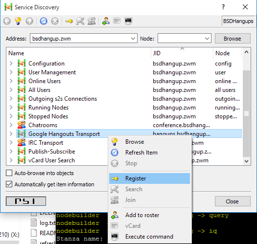

Copy the URL that is displayed in the window and open it in a webbrowser.

Follow the authorization procedure on Google's side.

You will obtain a code:

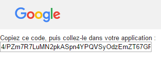

Copy it into the registration window and validate:

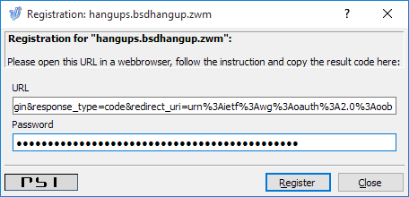

The transport is connected. You should see your contacts in the roster,
and get invitations to MUCs when there's activity in them.

### Getting contact and conference information

You can get information about your hangout contacts and your hangouts
conferences in the service discovery window:

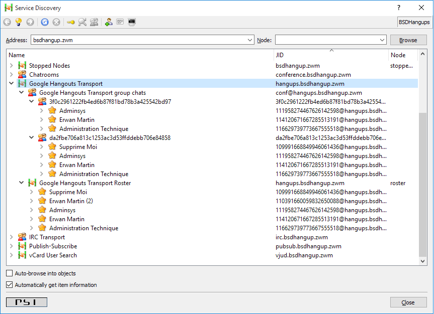

### Setting an alias to a conference id

By default, conference have their Hangout identifier as JIDs. This is
not very practical. The transport allows you to set alias to them.

Go to the service discovery, find your conference and execute a command:

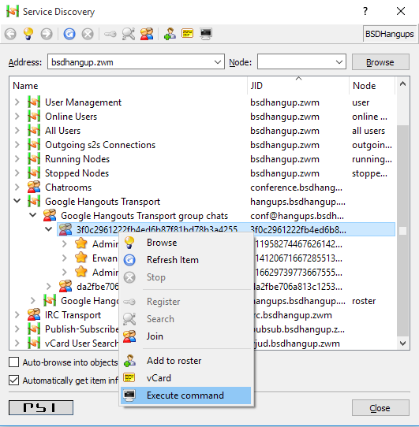

The only command available is the one to set an alias:

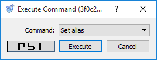

Choose an alias name and validate:

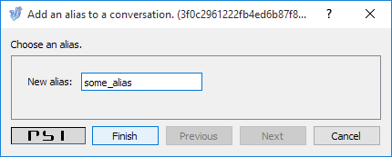

The conference will now be known as your alias in the roster, in the
list and in your window titles:

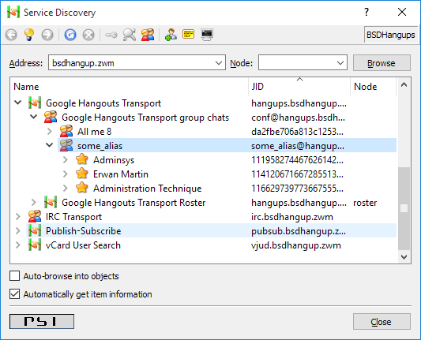

## Using Pidgin

### Register to the transport
Login to your XMPP account normally, like you would do if the transport
did not exist at all.

Make sure the service discovery plugin is enabled:

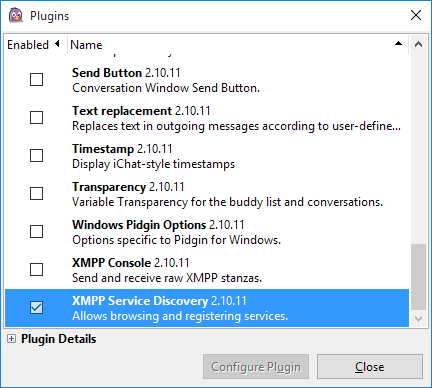

Open the service discovery window:

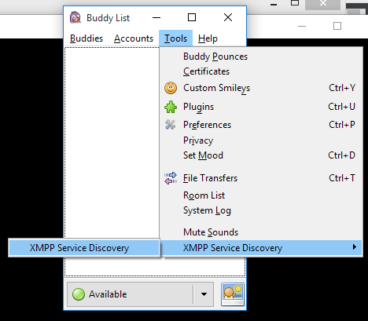

Browse the server node, find the transport, and register to it:

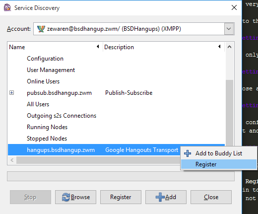

Copy the URL that is displayed in the window and open it in a webbrowser.

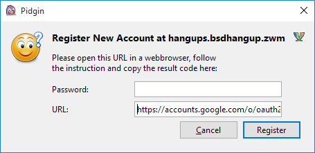

Follow the authorization procedure on Google's side.

You will obtain a code:

Copy it into the registration window and validate:

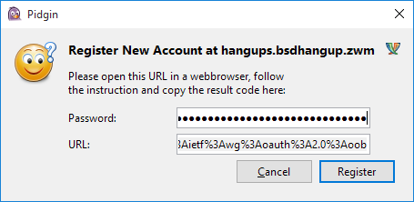

Your contact will appear. To fetch their name and profile picture,
right click on them and click "Get info".

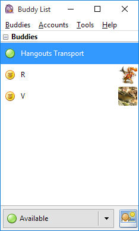

### Using conferences

Go to the room list:

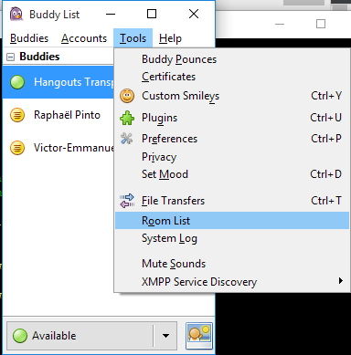

Query the room list from the transport, by browsing `conf@[jid of the transport]`:

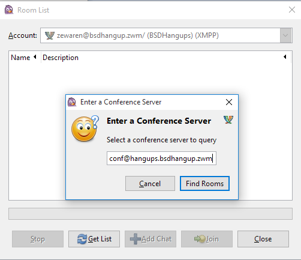

You'll get to the list of rooms:

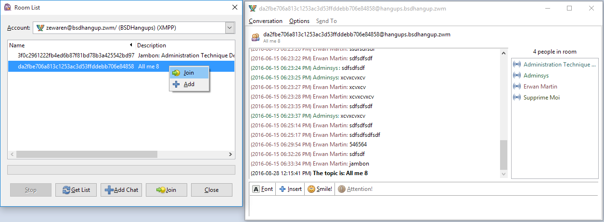

There, you can open them and add them as contacts (then you won't need
to go through this process every time you want to talk there).

You can't add aliases to conversations in Pidgin. However, if you set
them in another client, they will be taken into account in Pidgin too.
